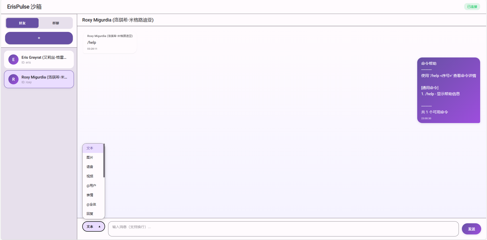

# ErisPulse 沙箱适配器

ErisPulse 的沙箱适配器，提供网页界面用于调试和模拟消息，
可以帮助您在不接入实际机器人平台的情况下进行开发和测试。

## 安装

```bash
pip install ErisPulse-SandboxAdapter
# 或者 epsdk install sandbox
```

## 配置

在 `config.toml` 中添加以下配置：

```toml
[SandboxAdapter]
self_id = "sandbox_bot"
enable = true
```

## 消息发送

沙箱适配器支持链式消息发送 DSL，支持以下功能：

### 基本发送方法

```python
# 发送文本
adapter.Send.To("user", "123").Text("Hello")

# 发送图片
adapter.Send.To("user", "123").Image("image_url")

# 发送表情
adapter.Send.To("group", "456").Face(1)
```

### 链式修饰方法

```python
# @用户
adapter.Send.To("group", "456").At("user123").Text("Hello")

# @全体成员
adapter.Send.To("group", "456").AtAll().Text("Everyone")

# 回复消息
adapter.Send.To("group", "456").Reply("msg_id").Text("Reply")

# 链式组合
adapter.Send.To("group", "456").At("user1").At("user2").Reply("msg_id").Text("Hello")
```

### 原始消息发送

```python
# 发送 OneBot12 格式消息段
adapter.Send.To("group", "456").Raw_ob12([
    {"type": "text", "data": {"text": "Hello"}},
    {"type": "image", "data": {"file": "url"}}
])
```

### 大小写不敏感

方法名支持大小写不敏感调用：

```python
# 以下调用方式等效
adapter.Send.To("user", "123").Text("hi")
adapter.Send.To("user", "123").text("hi")
adapter.Send.To("user", "123").TEXT("hi")
```

### 不支持的方法

调用不支持的方法时，会自动发送文本提示：

```python
adapter.Send.To("user", "123").UnsupportedMethod("data")
# 实际发送: "[不支持的发送类型] 方法名: UnsupportedMethod, 参数: [data]"
```

## 开发
沙箱适配器可以模拟一个完整的标准适配器，可以辅助开发和调试，使用时请确保你进行了多适配器的适配
在获取到事件event后可以获取platform属性进行平台判断，具体实现请查看ErisPulse的官方文档

## 使用

1. 启动适配器后，访问 `http://localhost:8000/sandbox/`（端口号根据你的配置）
2. 在网页中添加虚拟好友或群聊
3. 选择一个聊天，发送消息
4. 适配器会自动将消息转换为 OneBot12 标准事件并发送给模块

## 网页界面功能
