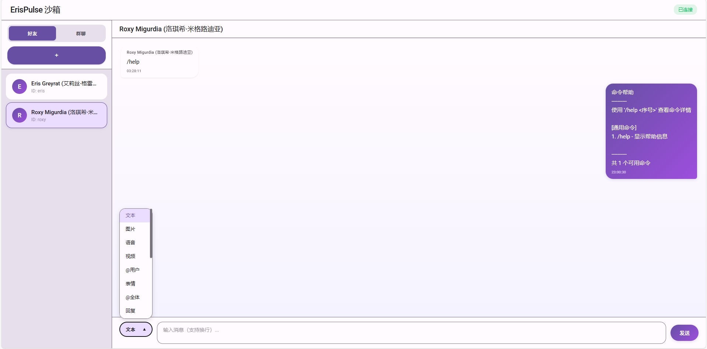

# ErisPulse Sandbox Adapter

[English](#english) | [中文](#中文)

---

<a id="english"></a>

## English

A Sandbox adapter for the [ErisPulse](https://github.com/ErisPulse/ErisPulse/) framework, providing a web UI for debugging and simulating messages. It helps you develop and test your bot without connecting to a real bot platform.

### Features

- **Web UI**: Built-in browser interface for testing at `http://localhost:8000/sandbox/`
- **Message Simulation**: Create virtual friends or group chats, then send messages as them
- **Standard Adapter Compliance**: Fully simulates a standard adapter, emitting OneBot12 standard events
- **Chainable Send DSL**: Supports chainable message construction (Text, Image, Face, At, Reply, etc.)
- **Case-Insensitive Methods**: Method names can be called in any case (e.g., `Text`, `text`, `TEXT`)
- **Raw OneBot12 Sending**: Send raw OneBot12 message segments via `Raw_ob12`

> Version: v4.0.0

### Installation

```bash
pip install ErisPulse-SandboxAdapter
# or epsdk install sandbox
```

### Configuration

A default configuration is generated automatically on first run.

```toml
# config.toml
[SandboxAdapter]
self_id = "sandbox_bot"        # Sandbox bot ID (optional, default: sandbox_bot)
enable = true                  # Enable the adapter (optional, default: true)
```

### Sending Messages

The Sandbox adapter supports the chainable message-sending DSL with the following features:

#### Basic Send Methods

```python
# Send text
adapter.Send.To("user", "123").Text("Hello")

# Send image
adapter.Send.To("user", "123").Image("image_url")

# Send face/emoji
adapter.Send.To("group", "456").Face(1)
```

#### Chainable Modifiers

```python
# @user
adapter.Send.To("group", "456").At("user123").Text("Hello")

# @all members
adapter.Send.To("group", "456").AtAll().Text("Everyone")

# Reply to a message
adapter.Send.To("group", "456").Reply("msg_id").Text("Reply")

# Chained combination
adapter.Send.To("group", "456").At("user1").At("user2").Reply("msg_id").Text("Hello")
```

#### Raw Message Sending

```python
# Send OneBot12 format message segments
adapter.Send.To("group", "456").Raw_ob12([
    {"type": "text", "data": {"text": "Hello"}},
    {"type": "image", "data": {"file": "url"}}
])
```

#### Case-Insensitive Method Names

Method names are case-insensitive:

```python
# The following calls are equivalent
adapter.Send.To("user", "123").Text("hi")
adapter.Send.To("user", "123").text("hi")
adapter.Send.To("user", "123").TEXT("hi")
```

#### Unsupported Methods

When an unsupported method is called, a text notice is sent automatically:

```python
adapter.Send.To("user", "123").UnsupportedMethod("data")
# Actually sent: "[不支持的发送类型] 方法名: UnsupportedMethod, 参数: [data]"
```

### Development

The Sandbox adapter can simulate a complete standard adapter, helping you develop and debug. When using it, ensure your code handles multiple adapters. After receiving an event, you can read the `platform` attribute to determine the platform. See the official ErisPulse documentation for implementation details.

### Usage

1. After starting the adapter, visit `http://localhost:8000/sandbox/` (port depends on your configuration)
2. Add virtual friends or group chats in the web UI
3. Select a chat and send a message
4. The adapter automatically converts the message into an OneBot12 standard event and delivers it to your modules

### Web UI



---

<a id="中文"></a>

## 中文

ErisPulse 的沙箱适配器，提供网页界面用于调试和模拟消息，
可以帮助您在不接入实际机器人平台的情况下进行开发和测试。

## 安装

```bash
pip install ErisPulse-SandboxAdapter
# 或者 epsdk install sandbox
```

## 配置

首次运行会自动生成默认配置。

```toml
# config.toml
[SandboxAdapter]
self_id = "sandbox_bot"        # 沙箱机器人ID（可选，默认为 sandbox_bot）
enable = true                  # 是否启用（可选，默认为true）
```

## 消息发送

沙箱适配器支持链式消息发送 DSL，支持以下功能：

### 基本发送方法

```python
# 发送文本
adapter.Send.To("user", "123").Text("Hello")

# 发送图片
adapter.Send.To("user", "123").Image("image_url")

# 发送表情
adapter.Send.To("group", "456").Face(1)
```

### 链式修饰方法

```python
# @用户
adapter.Send.To("group", "456").At("user123").Text("Hello")

# @全体成员
adapter.Send.To("group", "456").AtAll().Text("Everyone")

# 回复消息
adapter.Send.To("group", "456").Reply("msg_id").Text("Reply")

# 链式组合
adapter.Send.To("group", "456").At("user1").At("user2").Reply("msg_id").Text("Hello")
```

### 原始消息发送

```python
# 发送 OneBot12 格式消息段
adapter.Send.To("group", "456").Raw_ob12([
    {"type": "text", "data": {"text": "Hello"}},
    {"type": "image", "data": {"file": "url"}}
])
```

### 大小写不敏感

方法名支持大小写不敏感调用：

```python
# 以下调用方式等效
adapter.Send.To("user", "123").Text("hi")
adapter.Send.To("user", "123").text("hi")
adapter.Send.To("user", "123").TEXT("hi")
```

### 不支持的方法

调用不支持的方法时，会自动发送文本提示：

```python
adapter.Send.To("user", "123").UnsupportedMethod("data")
# 实际发送: "[不支持的发送类型] 方法名: UnsupportedMethod, 参数: [data]"
```

## 开发
沙箱适配器可以模拟一个完整的标准适配器，可以辅助开发和调试，使用时请确保你进行了多适配器的适配
在获取到事件event后可以获取platform属性进行平台判断，具体实现请查看ErisPulse的官方文档

## 使用

1. 启动适配器后，访问 `http://localhost:8000/sandbox/`（端口号根据你的配置）
2. 在网页中添加虚拟好友或群聊
3. 选择一个聊天，发送消息
4. 适配器会自动将消息转换为 OneBot12 标准事件并发送给模块

## 网页界面功能

